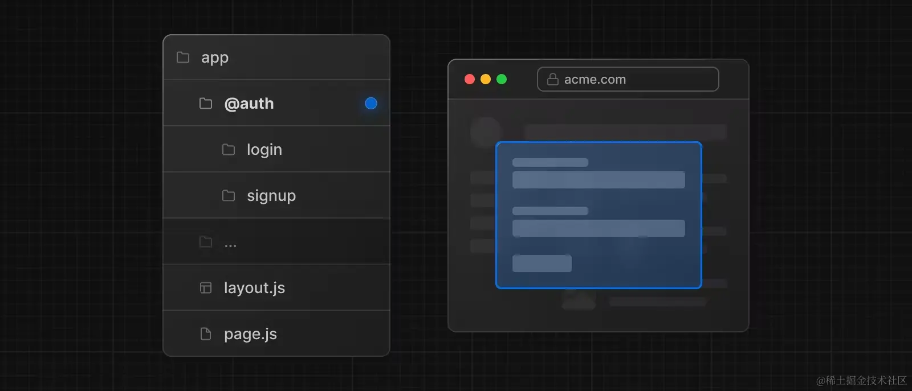

如果学过react的话会很容易上手
主要区别就是NEXT.js提供了三个方法用于服务端渲染

1. getInitialProps （最新版本不用它了）
2. getStaticProps
3. getStaticPaths
4. getServerSideProps

学会这些方法的使用，其余的都是react的知识点了

推荐看这篇文章：[快速理解 Next.js 中数据获取方式的作用及区别（getInitialProps、getServerSideProps、getStaticProps）](https://www.pipipi.net/20406.html)

不理解渲染方式的可以看这篇：[快速理解 Next.js 中各种渲染方式的作用及区别（SSG、SSR、ISR、CSR）](https://juejin.cn/post/7213653429415559223)

## 路由模式

有两种，目前比较流行的是App Router

### Pages Router

在`src`目录下创建`pages`文件夹或者项目根目录下创建`pages`文件夹，其中的js文件会被视为路由

### App Router

v13.4开始，App Router正式进入稳定化阶段，App Router功能更强、性能更好、代码组织更加灵活

在`src`目录下创建`app`文件夹或者项目根目录下创建`app`文件夹，其中的`page.js`文件会被视为路由

### 定义布局（Layouts）

布局指的是多个页面共享的UI。在页面导航的时候，布局会保留状态，不会重新渲染。例如：后台管理系统的侧边栏

新建一个名为`layout.js`的文件，该文件默认导出一个React组件，该组件接受一个`children` prop，`children`表示子布局或者子组件

同一文件夹下如果有 `layout.js` 和 `page.js`，page 会作为 children 参数传入 layout。换句话说，layout 会包裹同层级的 page。

使用方法见本项目`app/dashboard`目录用法

### 定义模板（template）

模板类似于`布局(layout)`，它也会传入每个子布局或者页面。**但不会像布局那样维持状态。**

模板在路由切换时会为每一个 `children` 创建一个实例。这就意味着当用户在**共享一个模板的路由间跳转**的时候，将会*
*重新挂载组件实例，重新创建
DOM 元素，不保留状态**.

- 依赖于 useEffect 和 useState 的功能，比如记录页面访问数（维持状态就不会在路由切换时记录访问数了）、用户反馈表单（每次重新填写）等

- 更改框架的默认行为，举个例子，布局内的 Suspense 只会在布局加载的时候展示一次 fallback UI，当切换页面的时候不会展示。但是使用模板，fallback
  会在每次路由切换的时候展示。

### 定义加载界面（loading）

用于展示加载界面的`loading.js`，这个功能的实现借助了React的`Suspense`API

### 定义错误处理（error.js）

创建错误时展示的UI

其实现借助了 `React` 的 `Error Boundary` 功能。简单来说，就是给 page.js 和 children 包了一层 ErrorBoundary。

### 定义404页面（not-found.js）

在 app 目录下新建一个 `not-found.js`

## 链接和导航

1. 使用`<Link>`组件
2. 使用 `useRouter` Hook

# 动态路由、路由组、平行路由和拦截路由

## 动态路由

### [folderName]

使用动态路由，你需要将文件夹的名字用方括号括住，比如 `[id]`、`[slug]`。这个路由的名字会作为 `param` prop
传给`布局（layout）`、 `页面（page）`、 `路由处理程序（route）`以及 `generateMetadata（用于生成页面元数据）` 函数。

### [...folderName]

在命名文件夹的时候，如果你在方括号内添加省略号，比如 [...folderName]，这表示捕获所有后面所有的路由片段。

也就是说，`app/shop/[...slug]/page.js`会匹配 `/shop/clothes`，也会匹配 `/shop/clothes/tops`、`/shop/clothes/tops/t-shirts`
等等。

### [[...folderName]]

在命名文件夹的时候，如果你在双方括号内添加省略号，比如 [[...folderName]]，这表示可选的捕获所有后面所有的路由片段。

## 路由组（Route groups）

在`app`目录下，文件夹名称通常会被映射到 `URL` 中，但你可以将文件夹标记为路由组，阻止文件夹名称被映射到 `URL` 中。

使用路由组，你可以将路由和项目文件按照逻辑进行分组，但不会影响 URL 路径结构。路由组可用于比如：

- 按站点、意图、团队等将路由分组
- 在同一层级中创建多个布局，甚至是创建多个根布局

那么该如何标记呢？把文件夹用括号括住就可以了

### 按逻辑分组

将路由按逻辑分组，但不影响 URL 路径：

### 创建不同布局

借助路由组，即便在同一层级，也可以创建不同的布局：

在这个例子中，`/account` 、`/cart`、`/checkout` 都在同一层级。但是 `/account`和 `/cart`使用的是 `/app/(shop)/layout.js`
布局和`app/layout.js`布局，`/checkout`使用的是 `app/layout.js`

### 创建多个根布局

创建多个根布局，你需要删除掉 app/layout.js 文件，然后在每组都创建一个
layout.js文件。创建的时候要注意，因为是根布局，所以要有 <html> 和 <body> 标签。

## 平行路由

平行路由可以使你在同一个布局中同时或者有条件的渲染一个或者多个页面（类似于 Vue 的插槽功能）。

### 条件渲染

平行路由的使用方式是将文件夹以`@`作为开头进行命名，这个文件夹下面的`page.js`将会自动注入文件夹同级`layout`的props中

### 独立错误处理和加载

平行路由可以让你为每个路由定义独立的错误处理和加载界面：

### 新约定文件default.js

访问`/about`，会报404，这是因为匹配不到`app/layout.js`里面的`team`和`analytics`，所以我们可以在`@team`和`@analytics`
下都添加一个`default.js`

### 用途：实现modal

在实际开发中，平行路由可以用于渲染弹窗（Modal）

